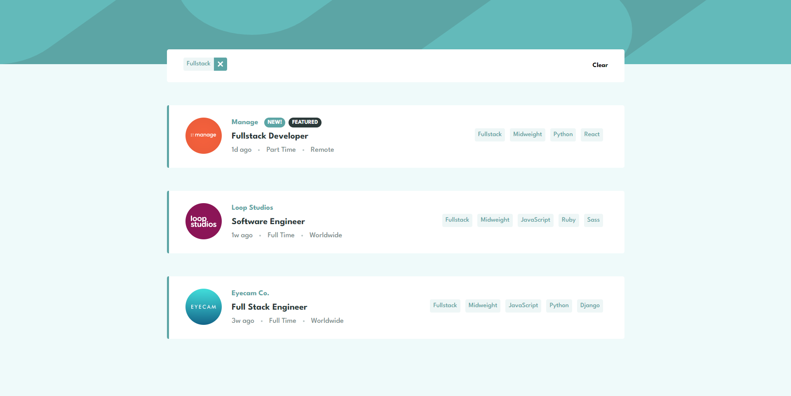

# Frontend Mentor - Job listings with filtering solution

This is a solution to the [Job listings with filtering challenge on Frontend Mentor](https://www.frontendmentor.io/challenges/job-listings-with-filtering-ivstIPCt). Frontend Mentor challenges help you improve your coding skills by building realistic projects.

## Table of contents

- [Overview](#overview)
  - [The challenge](#the-challenge)
  - [Screenshot](#screenshot)
  - [Links](#links)
- [My process](#my-process)
  - [Built with](#built-with)
  - [What I learned](#what-i-learned)
  - [Continued development](#continued-development)
  - [Useful resources](#useful-resources)
- [Author](#author)
- [Acknowledgments](#acknowledgments)

## Overview

### The challenge

Users should be able to:

- View the optimal layout for the site depending on their device's screen size
- See hover states for all interactive elements on the page
- Filter job listings based on the categories

### Screenshot

### Links

- Solution URL: [https://github.com/HarLey021/Job-listing]
- Live Site URL: [https://job-listing-harley021.vercel.app/]

## My process

### Built with

- HTML5
- Tailwindcss
- vite
- Flexbox
- Mobile-first workflow
- React
- TypeScript

### What I learned

This project showcases my proficiency in working with Tailwind CSS and Vite, two powerful tools that have significantly enhanced my web development skills. Leveraging Tailwind CSS's utility-first approach, I've achieved efficient and flexible styling, while Vite's rapid build system has streamlined my development workflow.

### Continued development

My journey with Tailwind CSS is an ongoing exploration of its capabilities and nuances. By continuing to work with Tailwind, I aim to deepen my understanding and proficiency in crafting efficient, maintainable, and visually stunning user interfaces.
